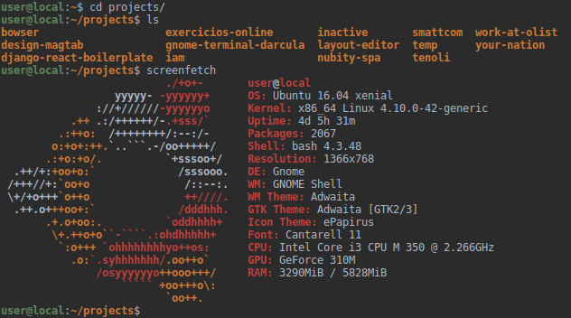
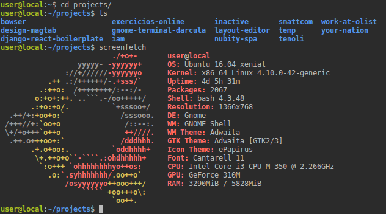

**********************
GNOME Terminal Darcula
**********************

IntelliJ Darcula color scheme for GNOME Terminal.

Thanks to `terminal.sexy <https://terminal.sexy/>`_!

You can download these schemes directly from terminal.sexy for any terminal,
but for some reason sharing schemes does not work correctly at the time of
writing this.

* `Darcula Editor <https://terminal.sexy/#KysrqbfGKysrvD88XodZzHgyzHgyhWePd7dnqbfGKysrvD88XodZzHgyzHgyhWePd7dnqbfG>`_
* `Darcula Console <https://terminal.sexy/#Kysru7u7Kysr_2toqMAj1r9VU5Tsroq-KZmZmZmZVVVV_2toqMAj1r9VU5Tsroq-KZmZmZmZ>`_

Screenshots
===========

Darcula Editor
--------------

Darcula Console
---------------

Installing
==========

Clone or download this repository and run:

.. code-block:: bash

   $ bash install.sh

Then load the scheme on your terminal with Right click > Profiles > SCHEME.

Authors
=======

* **Daniel Ramos**
